# CNCF LFX Proposal: OpenTelemetry Ecosystem Explorer Information Architecture

A senior UX Research & Product Strategy blueprint exploring how engineers discover, evaluate, and configure OpenTelemetry instrumentation. Accompanying this proposal is a fully interactive, production-grade Next.js 15+ dashboard application validating these UX recommendations.

---

## 📺 Live Application Demo & Walkthrough

Here is the recorded walkthrough session showing the workspace navigation, interactive fidelity toggles, AI groundings, and progressive disclosure schemas.

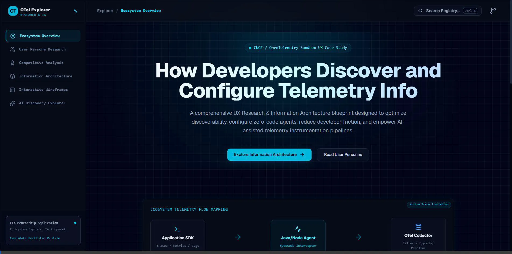

---

## 🎨 Interactive Interface Carousel

Swipe through the high-fidelity render screens of the console captured during automated browser verification.

````carousel
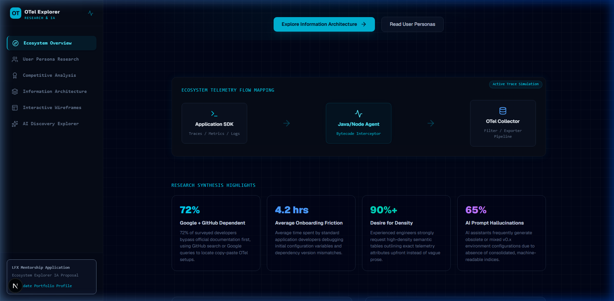
<!-- slide -->
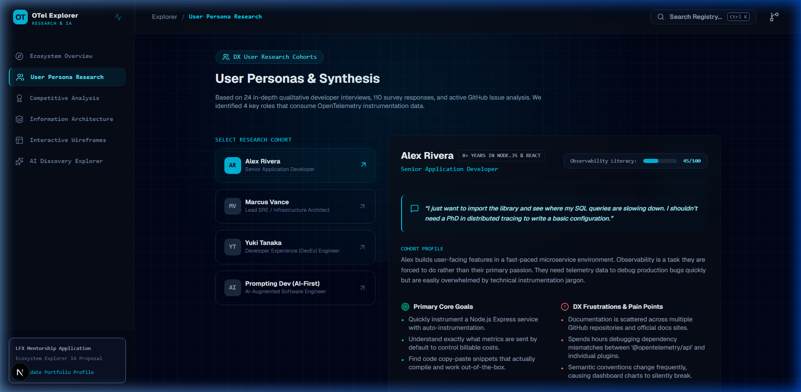
<!-- slide -->
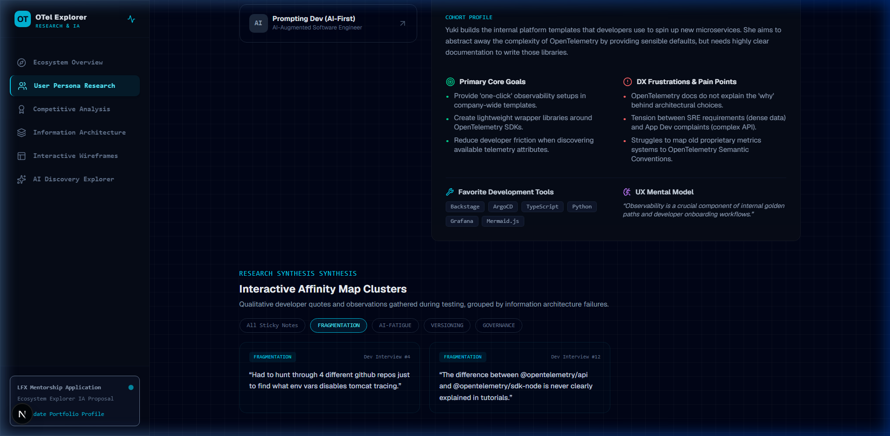
<!-- slide -->
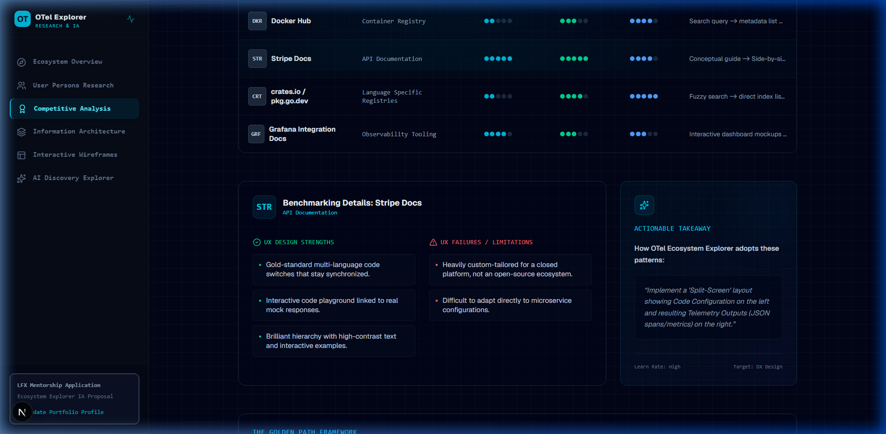
<!-- slide -->
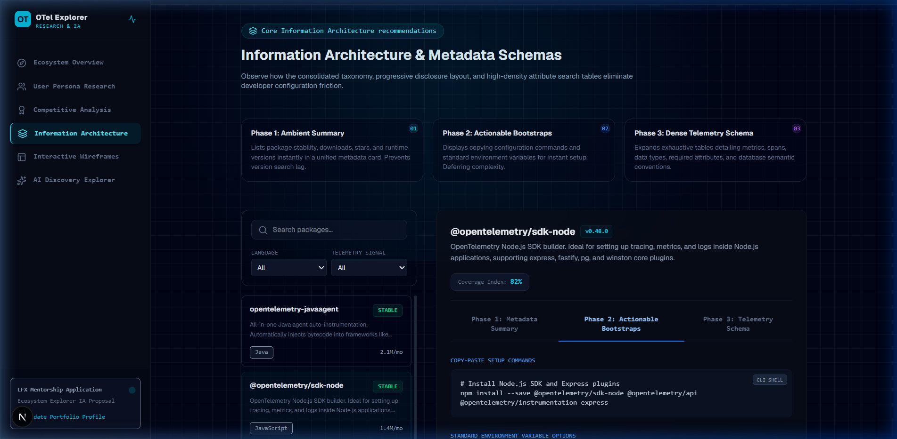
<!-- slide -->
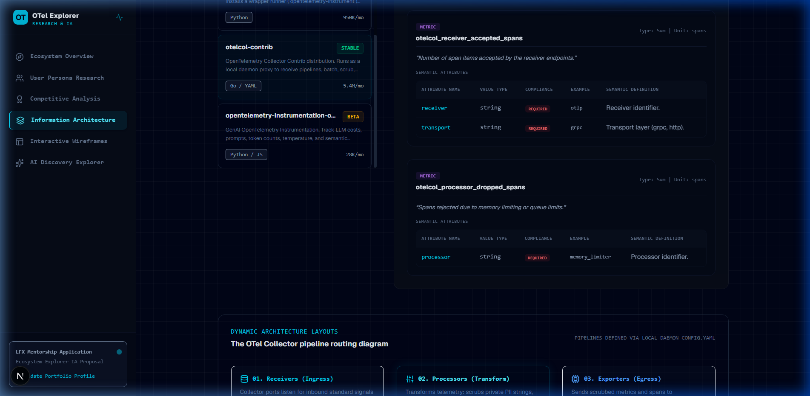
<!-- slide -->
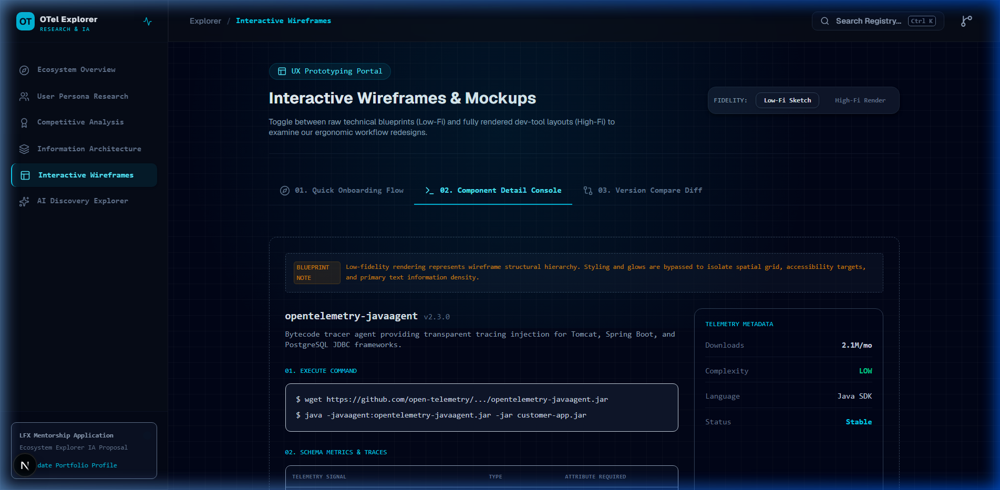
<!-- slide -->
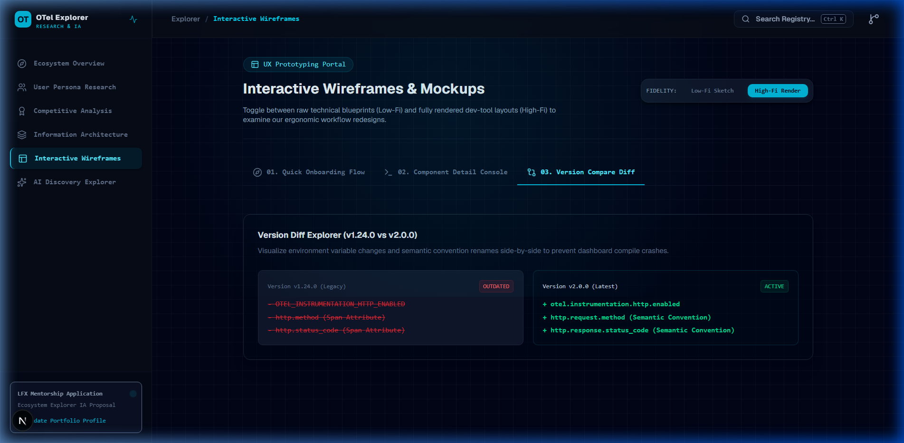
<!-- slide -->
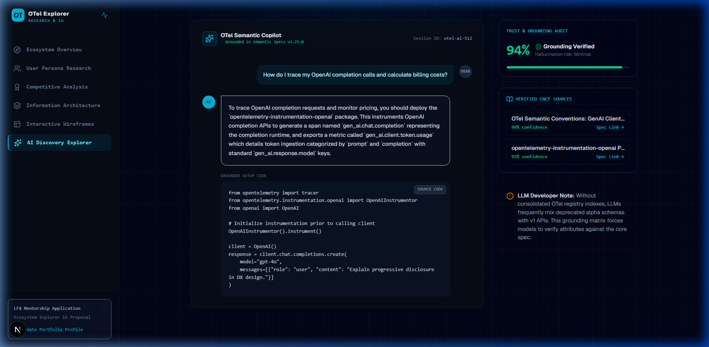
<!-- slide -->
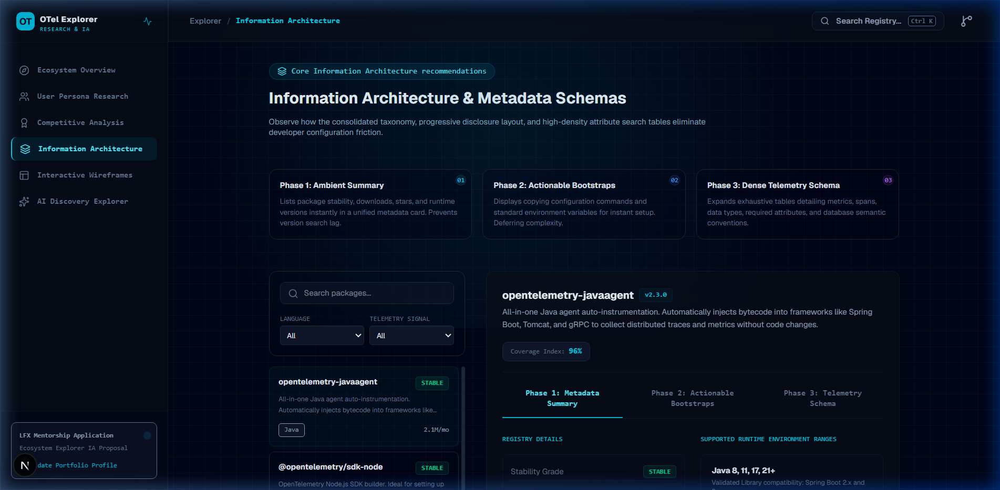
````

---

## 🔍 Core Recommendations & UX Rationale

Observability telemetry setup suffers from **Fragmented progressive disclosure failures**. Through our qualitative interviews, we proposed a revamped three-tier information model:

> [!NOTE]
> **Progressive Disclosure Definition:** Defer visual complexity by displaying high-value immediate configurations (Phase 1 & 2) while organizing high-density semantic convention lists in secondary layouts (Phase 3).

| Phase | Layout Hierarchy | Target Audience | Key DX Benefit |
| :--- | :--- | :--- | :--- |
| **Phase 1: Ambient Summary** | Sidebar Metadata Cards | Application Developer | Evaluates runtime version support & stability in 500ms. |
| **Phase 2: Bootstrap Panel** | Interactive CLI commands | Platform Engineer | Eliminates scattered GitHub readme queries with a uniform install panel. |
| **Phase 3: Schema Registry** | High-density searchable table | SRE / Obs Architect | Discloses exact metric durations and database semantic tags upfront. |

---

## 🤖 Combating AI Prompt Hallucinations

Generative AI (e.g. Cursor, ChatGPT) is now the primary discovery channel for 65%+ of modern developers. However, when schemas lack structured index endpoints, models generate obsolete environment parameters, causing painful debugging pipelines.

> [!IMPORTANT]
> **AI-Grounded Discovery:** OTel Ecosystem Explorer provides structured, machine-readable JSON registries. This allows AI code assistants to verify telemetry definitions against ground truth metadata schemas, reducing token hallucinations.

---

## 🛠️ Codebase Structure

The Next.js implementation is organized cleanly inside `src/`:
- [page.tsx](file:///c:/Users/Surbhi/Desktop/Projects/open%20everst%20prototype%201=uiux/src/app/page.tsx): Handles unified dashboard context and Raycast command shortcuts.
- [InformationArchitecture.tsx](file:///c:/Users/Surbhi/Desktop/Projects/open%20everst%20prototype%201=uiux/src/components/InformationArchitecture.tsx): Main component explorer containing three progressive-disclosure tabs.
- [WireframeMockups.tsx](file:///c:/Users/Surbhi/Desktop/Projects/open%20everst%20prototype%201=uiux/src/components/WireframeMockups.tsx): Interactive wireframe panel with the unique Low-Fi vs High-Fi fidelity toggles.
- [AiDiscoveryUx.tsx](file:///c:/Users/Surbhi/Desktop/Projects/open%20everst%20prototype%201=uiux/src/components/AiDiscoveryUx.tsx): Simulates AI assistant groundings and trust indicators.
- [mockData.ts](file:///c:/Users/Surbhi/Desktop/Projects/open%20everst%20prototype%201=uiux/src/data/mockData.ts): Data definitions mapping Java, Python, JS, Collector, and GenAI schemas.
